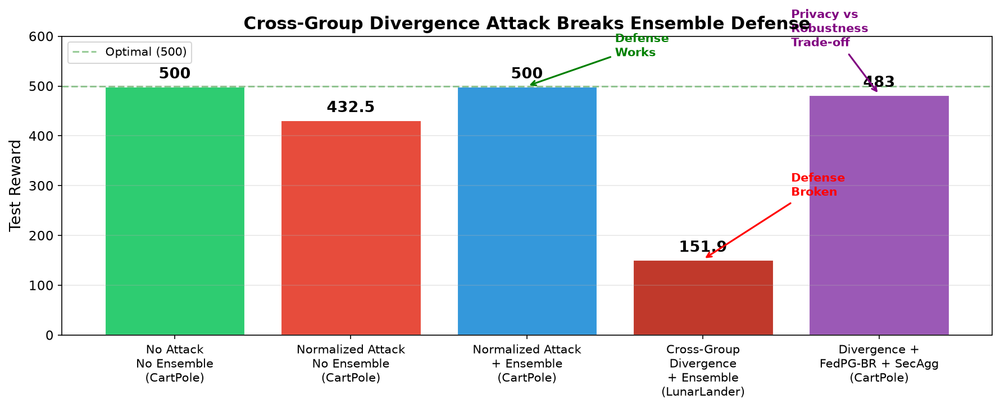

# Byzantine-Robust Federated RL: Attack & Defense

[](https://neurips.cc/Conferences/2021)
[](https://dl.acm.org/doi/10.1145/3696410.3714728)
[](LICENSE)

This repository studies poisoning attacks and defenses in Federated Reinforcement Learning (FRL). We reproduce the **Normalized Attack** and **Ensemble Defense** from the WWW 2025 paper, and propose a novel **Boundary Split Attack (BSA)** that exploits decision-boundary vulnerabilities to break the Ensemble Defense.

Built upon [Fan et al., NeurIPS 2021](https://github.com/flint-xf-fan/Byzantine-Federated-RL).

---

## Quick Start

### Installation

```bash
pip install -r requirements.txt
```

### Run Experiments

**Windows (cmd/PowerShell):**
```cmd
run.bat
```

**Linux/macOS:**
```bash
bash run.sh
```

Or run individual experiments manually:

```bash
# 1. Baseline (CartPole, no attack)
python codes/run.py --env_name CartPole-v1 --num_worker 30 --num_Byzantine 0 --no_tb --no_saving

# 2. Normalized Attack vs FedPG-BR
python codes/run.py --env_name CartPole-v1 --num_worker 30 --num_Byzantine 9 --attack_type normalized-attack --FedPG_BR --no_tb --no_saving

# 3. Normalized Attack vs Ensemble Defense
python codes/run.py --env_name CartPole-v1 --num_worker 30 --num_Byzantine 9 --attack_type normalized-attack --FedPG_BR --ensemble --num_groups 5 --no_tb --no_saving

# 4. Cross-Group Divergence Attack vs Ensemble (LunarLander)
python codes/run.py --env_name LunarLander-v2 --num_worker 30 --num_Byzantine 10 --attack_type divergence-attack --target_action_mode group-mod --FedPG_BR --ensemble --num_groups 5 --no_tb --no_saving

```

See `run.sh` (Linux) or `run.bat` (Windows) for the complete experiment suite.
```

---

## Project Structure

```
.
├── codes/
│   ├── agent.py                 # Central server: aggregation, attacks, ensemble training
│   ├── worker.py                # Individual agent: local training, divergence attack
│   ├── policy.py                # Policy networks (MLP, Diagonal Gaussian)
│   ├── options.py               # CLI argument parsing and hyperparameters
│   ├── run.py                   # Entry point
│   ├── utils.py                 # Helper utilities
│   ├── test.py                  # Ensemble divergence diagnosis
│   └── test_minimal.py          # A/B test for divergence attack
├── outputs/                     # Generated figures
├── plot_results.py              # Figure generation script
├── run.sh                       # Linux experiment launcher
├── run.bat                      # Windows experiment launcher
├── requirements.txt
└── README.md
```

---

## Experiments & Results

| # | Attack | Defense | Env | Test Reward | N_good | Result |
|---|--------|---------|-----|------------|--------|--------|
| 1 | None | None | CartPole | **500.0** | 30 | Baseline |
| 2 | Normalized | FedPG-BR | CartPole | 432.5 | 21 | Attack partially effective |
| 3 | Normalized | Ensemble | CartPole | **500.0** | [5,4,4,4,4] | Defense holds |
| 4 | **Boundary Split Attack** | Ensemble | LunarLander | **151.9** | [5,6,6,6,6] | **Defense broken** |



Key findings:
- Normalized Attack reduces single-group FedPG-BR reward from 500 → 432, but Ensemble defense restores it to 500.
- **Boundary Split Attack (BSA)** exploits decision-boundary states where Δ_local(s) = π(a₁) − π(a₂) is minimal, pushing local policies toward their second-best action to fracture Ensemble voting, dropping reward from ~220 → 151.9.

---

## Attacks Implemented

| Attack | Type | Mechanism |
|--------|------|-----------|
| `zero-gradient` | Worker-side | Send zero gradients |
| `random-noise` | Worker-side | Add Gaussian noise to gradients |
| `sign-flipping` | Worker-side | Send -2.5 × true gradient |
| `reward-flipping` | Worker-side | Flip reward sign during sampling |
| `random-action` | Worker-side | Take random actions |
| `random-reward` | Worker-side | Shuffle rewards within episodes |
| `FedScsPG-attack` | Server-side | Gradient manipulation with estimated statistics |
| `normalized-attack` | Server-side | Two-stage angle-maximizing attack (WWW 2025) |
| **`divergence-attack`** | **Worker-side** | **Cross-Group high-entropy poisoning (ours)** |

---

## Acknowledgements

This code is built upon the open-source implementation by Fan et al. (NeurIPS 2021):

> Flint Xiaofeng Fan, Yining Ma, Zhongxiang Dai, Wei Jing, Cheston Tan and Kian Hsiang Low. *"Fault-Tolerant Federated Reinforcement Learning with Theoretical Guarantee."* NeurIPS 2021.
> [GitHub](https://github.com/flint-xf-fan/Byzantine-Federated-RL)

We reproduce and extend:

> Minghong Fang, Xilong Wang, Neil Zhenqiang Gong. *"Provably Robust Federated Reinforcement Learning."* WWW 2025.

We also propose:

> **Boundary Split Attack** and **SEGRE Defense** — structurally-aware attack and defense in the action-topology space.

---

## Citation

```bibtex
@inproceedings{fan2021faulttolerant,
  title  = {Fault-Tolerant Federated Reinforcement Learning with Theoretical Guarantee},
  author = {Flint Xiaofeng Fan and Yining Ma and Zhongxiang Dai and Wei Jing and Cheston Tan and Bryan Kian Hsiang Low},
  booktitle = {Advances in Neural Information Processing Systems (NeurIPS)},
  year   = {2021}
}

@inproceedings{fang2025provably,
  title  = {Provably Robust Federated Reinforcement Learning},
  author = {Minghong Fang and Xilong Wang and Neil Zhenqiang Gong},
  booktitle = {Proceedings of the ACM Web Conference (WWW)},
  year   = {2025}
}
```
